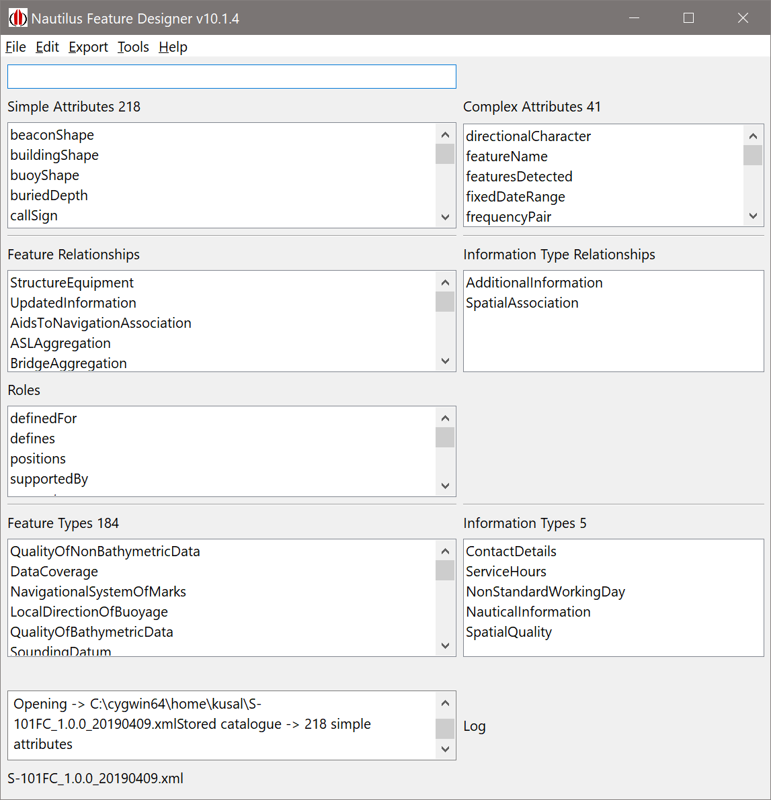

# Feature Designer
Test repository for IIC's Feature Designer application. 

This application is a feature catalogue viewer and editor and conforms to IHO S-100 feature catalogue XML. It can read, profile and create feature catalogues for use with any IHO S-100 conformant data production system.

Current Version is 10.1.4

## Location

* Installation images are contained in the Download directory and are version numbered Windows (10 only) .msi installables. you can also access the official releases through the "Releases" link to the right of this page. This will take you to a page where (under "assets") you can download the Windows (MSI) installer.
* You should have been supplied with install instructions and also guidance on how to get a key to unlock the individual features

## Documentation

* is coming... In the Doc directory in this repository

## Issues

* Please raise issues in the issues tab of this repository and they can be addressed. Insert as much information as possible. This application is still a BETA version and there are some unexpected behaviours and unimplemented functionality (still). 

##  Current Version

